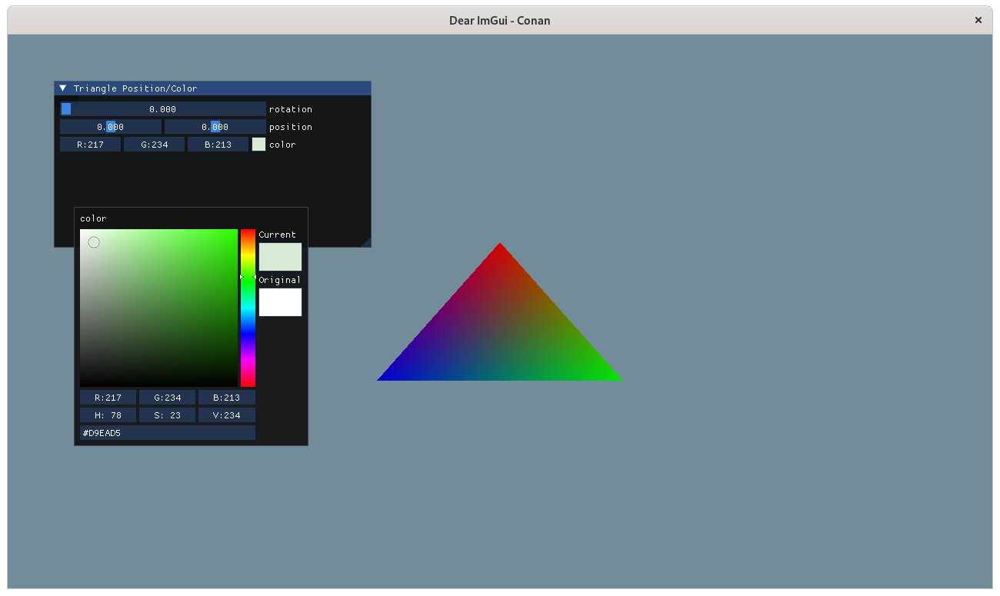
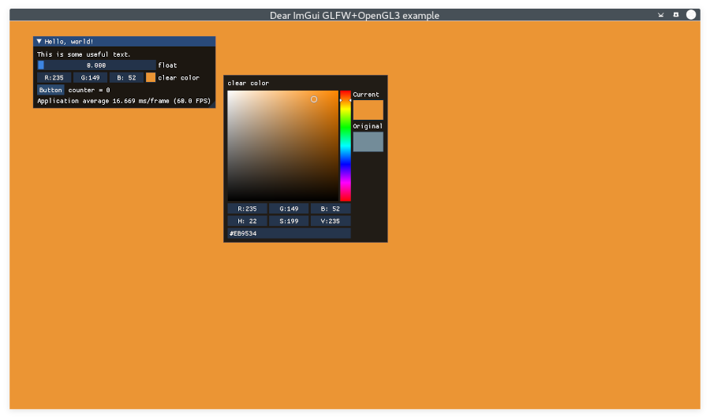

# Build c++ applications using imgui, cmake and opengl

This repository provides examples to build imgui applications with cmake and opengl. Code is relatively up to date with respect to all libraries and tools used. Note that not all imgui features are built and used.


## References
- Yongkie's `imgui cmake starter` [repo](https://gitlab.com/ywiyogo/imgui-cmake-starter.git)

- conan-io's `examples2` [repo](https://github.com/conan-io/examples2.git) and [blog](https://blog.conan.io/2019/06/26/An-introduction-to-the-Dear-ImGui-library.html)

- Two submodules: [imgui (docking branch)](https://github.com/ocornut/imgui.git) and [gl3w](https://github.com/skaslev/gl3w.git)


## Build on Rocky Linux 9.4 (Blue Onyx)

### Prerequisites

Install build tools, such as cmake, gnu c/c++, python. Install additional packages, e.g.

```
    yum install libXrandr-devel libXinerama-devel libXcursor-devel
    yum install glfw glfw-devel glew glew-devel
```


### Build and run

```
    git clone https://github.com/robinbest/imgui-opengl.git
    cd imgui-opengl
    git submodule init
    git submodule update
    mkdir build
    cd build
    cmake ..
    ./bin/imgui-opengl
```

If things go well, you'll see the main window with the original title!


### License

Owner of this repository does not claim any copyrights to code from two references. This repo is released under the MIT license.


## Original readme from `imgui cmake starter`

This project shows how to integrate ImGui for a CMake C++ project. The result can be seen like this screenshot:



### Prerequisites

On Ubuntu 21.04:

```
sudo apt install -y build-essential cmake libglew-dev libglfw3-dev xorg-dev
```

### Build

```
mkdir build && cd build
cmake ..
make
```

### References

1. https://github.com/ocornut/imgui.git
2. https://github.com/aniongithub/imgui-cmake